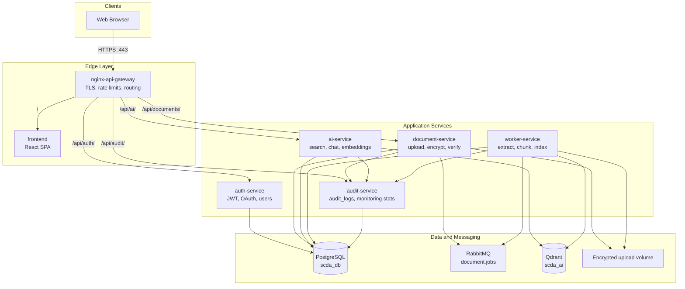

# Secure Compliance Document Assistant (SCDA)

## Project Overview

The Secure Compliance Document Assistant (SCDA) is a distributed, security-oriented document management platform designed for academic and compliance-oriented workflows. The system allows authenticated users to upload sensitive files, store them in encrypted form, verify integrity using cryptographic hashes, and query indexed content through semantic search and a document-scoped chat interface.

SCDA is implemented as a multi-container application orchestrated with Docker Compose. External clients interact only through an Nginx API gateway on HTTPS. Backend responsibilities are split across dedicated microservices for authentication, document handling, audit logging, artificial intelligence (retrieval-augmented generation), and asynchronous background processing. PostgreSQL provides relational persistence; RabbitMQ decouples upload acceptance from indexing work; Qdrant stores vector embeddings for similarity search.

The platform targets course and demonstration requirements for secure distributed systems: defense in depth at the edge and application layers, centralized audit trails, role-based access control, and a complete asynchronous document pipeline without exposing internal services directly to the public internet.

---

## System Architecture

### High-Level Diagram



### Service Communication

| From | To | Mechanism | Purpose |
|------|-----|-----------|---------|
| Browser | nginx-api-gateway | HTTPS | Single public entry point |
| Gateway | Microservices | HTTP (internal network) | Reverse proxy to Node services |
| document-service | RabbitMQ | AMQP publish | Queue background indexing jobs |
| worker-service | RabbitMQ | AMQP consume | Process `document.jobs` messages |
| All business services | audit-service | REST + `X-Internal-Api-Key` | Append security audit events |
| ai-service, worker | Qdrant | REST | Upsert and search vectors |
| Services | PostgreSQL | Prisma / SQL | Shared database `scda_db` |

The worker service is not routed through Nginx. It operates only on the internal Docker network and consumes messages from the queue.

### Business Service Mapping

| Rubric role | Implementation |
|-------------|----------------|
| Business Service 1 | `document-service` — document lifecycle and encryption |
| Business Service 2 | `audit-service` — centralized logging and admin monitoring |
| Logging / audit (mandatory) | `audit-service` — same service as Business Service 2 |
| AI / RAG tier | `ai-service` (API + embeddings) and `qdrant` (vector store) |
| Background processing | `worker-service` |

---

## Core Features

### Identity and Access

- User registration and login with bcrypt-hashed passwords stored in PostgreSQL.
- JWT access tokens (HS256) with configurable expiration.
- Role-based access control: `user` and `admin` (stored on `users.role`).
- Optional OAuth 2.0 sign-in for Google, GitHub, and Microsoft when provider credentials are configured (see `docs/OAUTH.md`).
- Protected API routes reject missing, invalid, or expired tokens.

### Document Management

- Secure upload with MIME type, extension, and size validation.
- Blocking of dangerous extensions (for example `.exe`, `.php`, `.js`, `.bat`, `.sh`).
- AES-256-GCM encryption at rest before files are written to a private Docker volume.
- SHA-256 integrity hashing with a verification endpoint for authorized owners.
- Per-user document isolation enforced in application code.
- Asynchronous processing via RabbitMQ with visible status transitions.

### Artificial Intelligence and Retrieval

- Deterministic hash-simulated embeddings (384 dimensions, L2-normalized) for reproducible demos without an external LLM API.
- Vector storage and cosine similarity search in Qdrant collection `scda_ai`.
- Semantic search with query expansion, hybrid ranking, and domain-aware short answers.
- Persisted chat sessions and messages in PostgreSQL.
- Document-scoped chat: answers are grounded in indexed chunks and PostgreSQL `document_chunks`, not invented by a generative model.
- Knowledge workspace UI combining document sidebar, semantic search, and chat.

### Operations and Compliance

- Central `audit_logs` table with structured fields: user, service, action, status, IP, details, timestamp.
- Admin monitoring dashboard at `/audit` with metrics: total users, requests, failed logins, uploaded files, processed jobs, unauthorized attempts, AI queries.
- Nginx rate limiting (stricter on login), security headers, and HTTP-to-HTTPS redirection.

---

## Workflow Descriptions

### 1. User Authentication

1. The client submits credentials to `POST /api/auth/register` or `POST /api/auth/login` through the gateway.
2. `auth-service` validates input, hashes passwords with bcrypt, and issues a JWT on success.
3. Subsequent requests include `Authorization: Bearer <token>`.
4. Each microservice validates the JWT independently using the shared `JWT_SECRET`.
5. Security-relevant login outcomes are written to `audit-service`.

### 2. Document Upload and Indexing

1. An authenticated user uploads a file to `POST /api/documents/upload`.
2. `document-service` validates the file, computes SHA-256 of plaintext, encrypts with AES-256-GCM, and stores ciphertext on the shared volume.
3. Metadata is saved in `documents`; status moves to `queued`.
4. A JSON message is published to RabbitMQ queue `document.jobs`.
5. `worker-service` consumes the message, decrypts the file, extracts text (PDF, TXT, DOCX, PPTX), chunks content, and writes rows to `document_chunks`.
6. Embeddings are upserted into Qdrant with `user_id` and `document_id` in the payload.
7. Status advances through `processing` to `ready` (or `failed`); worker and document events are audited.

### 3. Semantic Search

1. The client calls `GET /api/ai/search?q=...` with a valid JWT.
2. `ai-service` embeds the query, searches Qdrant filtered by `user_id`, and re-ranks hits using keyword overlap and domain boosts (integrity, encryption, audit).
3. A concise answer is synthesized from the best matching passage.

### 4. Document-Scoped Chat

1. The user opens the Knowledge workspace (`/ai`) and selects or mentions a document.
2. Messages are stored in `chat_messages`; retrieval prefers PostgreSQL chunks over weak vector matches.
3. Answers use the same ranking and domain logic as search, formatted for conversational display.
4. Chat lifecycle events are audited.

### 5. Admin Audit Review

1. An admin user accesses `GET /api/audit/logs` and `GET /api/audit/logs/stats`.
2. The SPA monitoring page displays aggregate metrics and a filterable log table.

---

## Technology Stack

| Layer | Technologies |
|-------|----------------|
| Frontend | React 18, TypeScript, Vite, Tailwind CSS, React Router |
| API gateway | Nginx 1.27 (Alpine), TLS 1.2+, `limit_req`, security headers |
| Backend | Node.js 20, Express.js, Prisma ORM |
| Authentication | JWT (HS256), bcrypt, express-validator |
| Cryptography | AES-256-GCM (files), SHA-256 (integrity) |
| Database | PostgreSQL 16 |
| Message queue | RabbitMQ 3 (management image) |
| Vector database | Qdrant |
| Orchestration | Docker Compose |
| Embeddings (demo) | Deterministic SHA-256-based vectors (hash-simulated), not OpenAI/Ollama |

---

## Services Reference

| Service | Compose name | Internal port | Host exposure | Responsibility |
|---------|--------------|---------------|---------------|----------------|
| API Gateway | `nginx-api-gateway` | 80, 443 | 80, 443 | TLS termination, routing, rate limits |
| Frontend | `frontend` | 80 | Via gateway only | React single-page application |
| Auth | `auth-service` | 3001 | 3001 (debug) | Register, login, JWT, OAuth |
| Documents | `document-service` | 3002 | 3002 (debug) | Upload, encrypt, verify, download |
| AI | `ai-service` | 3003 | 3003 (debug) | Health, analyze, search, chat |
| Audit | `audit-service` | 3004 | 3004 (debug) | Internal log ingestion, admin APIs |
| Worker | `worker-service` | — | None | Queue consumer, indexing pipeline |
| PostgreSQL | `postgres` | 5432 | 5432 (dev) | Shared relational database |
| RabbitMQ | `rabbitmq` | 5672, 15672 | 127.0.0.1 only | Job queue; management UI localhost-only |
| Qdrant | `qdrant` | 6333 | 6333 (dev) | Vector collection `scda_ai` |

---

## Security Features

| Control | Implementation |
|---------|----------------|
| HTTPS | Nginx TLS on port 443; HTTP redirects to HTTPS |
| Rate limiting | `10r/m` on login; `25r/s` general API per IP |
| Password storage | bcrypt hashes only in `users.password_hash` |
| Authorization | JWT on protected routes; `admin` role for audit APIs |
| File validation | Allowlisted MIME types and extensions; size limits |
| Encryption at rest | AES-256-GCM on upload volume |
| Integrity | SHA-256 stored; `GET /api/documents/:id/verify` |
| Service-to-service | `X-Internal-Api-Key` on `POST /api/audit/log` |
| Secrets | `.env` (gitignored); placeholders in `.env.example` |
| Queue security | Dedicated RabbitMQ user `scda_mq` (not `guest/guest`) |
| Safe errors | JSON `{ error: { message } }` without stack traces |

**Documented simplifications:** `users.role` enum only (no separate permissions tables); client-side logout (JWT removed from browser storage without server revocation); OAuth requires operator configuration of provider credentials.

Further detail: `SECURITY_COMPLIANCE_CHECKLIST.md`, `ARCHITECTURE_COMPLIANCE.md`.

---

## Frontend Features

| Route | Page | Description |
|-------|------|-------------|
| `/login`, `/register` | Authentication | Email/password and optional OAuth buttons |
| `/oauth/callback` | OAuth return | Receives token in URL hash fragment |
| `/` | Dashboard | Overview, KPIs, navigation modules |
| `/documents` | Document vault | Upload, list, verify, download, status polling |
| `/ai` | Knowledge workspace | Document sidebar, semantic search, document-scoped chat |
| `/security` | Security center | Architecture summary and compliance references |
| `/audit` | Monitoring (admin) | Seven metric cards and audit log table |

The production build is served by the `frontend` container and proxied at `/` by the gateway. API calls use same-origin paths (`/api/...`) when deployed with Docker Compose.

---

## Database Schema (Summary)

| Table | Owning concern | Purpose |
|-------|----------------|---------|
| `users` | auth-service | Accounts, bcrypt hash, role |
| `oauth_accounts` | auth-service | External provider linkage |
| `documents` | document-service | Metadata, encryption path, SHA-256, status |
| `document_chunks` | document-service | Extracted text segments for RAG |
| `audit_logs` | audit-service | Central security event store |
| `chat_sessions` | ai-service | Persisted chat threads |
| `chat_messages` | ai-service | User and assistant messages |

All services share the database name `scda_db` in the default Compose configuration.

---

## Setup and Installation

### Prerequisites

- Docker Engine and Docker Compose v2
- OpenSSL (optional; certificate generation can use an Alpine container)

### 1. Environment configuration

From the repository root:

```powershell
copy .env.example .env
```

Edit `.env` and set at minimum:

| Variable | Purpose |
|----------|---------|
| `JWT_SECRET` | Shared HS256 secret for all JWT-validating services |
| `INTERNAL_API_KEY` | Protects audit log ingestion endpoint |
| `ENCRYPTION_KEY` | Exactly 64 hex characters (32 bytes) for AES-256-GCM |
| `RABBITMQ_USER`, `RABBITMQ_PASS`, `RABBITMQ_URL` | Must match; do not use `guest/guest` |

See `.env.example` for optional overrides (`JWT_EXPIRES_IN`, `QDRANT_COLLECTION`, OAuth variables, and others).

### 2. TLS certificates

Create `nginx/certs/fullchain.pem` and `nginx/certs/privkey.pem` before starting the gateway.

**Windows (PowerShell):**

```powershell
New-Item -ItemType Directory -Force -Path ".\nginx\certs" | Out-Null
docker run --rm -v "${PWD}/nginx/certs:/out" alpine:3.20 sh -c "apk add --no-cache openssl >/dev/null && openssl req -x509 -nodes -days 825 -newkey rsa:2048 -subj '/CN=localhost' -keyout /out/privkey.pem -out /out/fullchain.pem"
```

### 3. Build and start

```powershell
docker compose up -d --build
```

Verify containers:

```powershell
docker compose ps
```

### 4. First use

1. Open `https://localhost/` (accept the self-signed certificate warning in development).
2. Register a user, then sign in.
3. Promote an admin for audit access (one-time):

```powershell
docker compose exec -T postgres psql -U scda_user -d scda_db -c "UPDATE users SET role = 'admin' WHERE email = 'your@email.com';"
```

4. Re-login to refresh the JWT role claim.

---

## API Examples

Base URL: `https://localhost` (use `curl.exe -sk` for self-signed TLS on Windows).

### Health

```powershell
curl.exe -sk https://localhost/nginx-health
curl.exe -sk https://localhost/api/ai/health
```

### Register and login

```powershell
curl.exe -sk https://localhost/api/auth/register -H "Content-Type: application/json" -d "{\"email\":\"demo@example.com\",\"password\":\"password12345\"}"

$login = curl.exe -sk https://localhost/api/auth/login -H "Content-Type: application/json" -d "{\"email\":\"demo@example.com\",\"password\":\"password12345\"}" | ConvertFrom-Json
$token = $login.access_token

curl.exe -sk https://localhost/api/auth/profile -H "Authorization: Bearer $token"
```

### Upload and list documents

```powershell
curl.exe -sk https://localhost/api/documents/upload -H "Authorization: Bearer $token" -F "file=@test-document.pdf"
curl.exe -sk https://localhost/api/documents -H "Authorization: Bearer $token"
```

### Verify integrity

```powershell
curl.exe -sk "https://localhost/api/documents/DOCUMENT_UUID/verify" -H "Authorization: Bearer $token"
```

### Semantic search

```powershell
curl.exe -sk "https://localhost/api/ai/search?q=How+does+the+system+verify+file+integrity&limit=5" -H "Authorization: Bearer $token"
```

### Chat session

```powershell
$chat = curl.exe -sk https://localhost/api/ai/chat/sessions -H "Authorization: Bearer $token" -H "Content-Type: application/json" -d "{}" | ConvertFrom-Json
$sid = $chat.session.id
curl.exe -sk "https://localhost/api/ai/chat/sessions/$sid/messages" -H "Authorization: Bearer $token" -H "Content-Type: application/json" -d "{\"content\":\"Summarize the document\"}"
```

### Admin audit (admin JWT required)

```powershell
curl.exe -sk "https://localhost/api/audit/logs?limit=20" -H "Authorization: Bearer $token"
curl.exe -sk https://localhost/api/audit/logs/stats -H "Authorization: Bearer $token"
```

### Internal audit ingestion (service key)

```powershell
$key = (Get-Content .env | Where-Object { $_ -match '^INTERNAL_API_KEY=' }) -replace 'INTERNAL_API_KEY=',''
curl.exe -sk -X POST https://localhost/api/audit/log -H "Content-Type: application/json" -H "X-Internal-Api-Key: $key" -d "{\"service\":\"manual-test\",\"action\":\"proof.event\",\"status\":\"success\"}"
```

Extended command suites: `RUNBOOK.md`, `FINAL_TEST_COMMANDS.md`, `SECURITY_TEST_COMMANDS.md`.

---

## Security Test Examples

| Test | Expected result | Command reference |
|------|-----------------|-------------------|
| Invalid login | HTTP 401 | `SECURITY_TEST_COMMANDS.md` section 1.6 |
| Missing JWT on protected route | HTTP 401 | section 1.3 |
| Invalid JWT | HTTP 401 | section 1.4 |
| Non-admin audit access | HTTP 403 | section 3.2 |
| Blocked file extension | HTTP 415 | section 9.2 |
| Login rate limit | HTTP 429 after burst | section 7.1 |
| Missing internal API key | HTTP 403 on `/api/audit/log` | section 12.2 |
| HTTP redirect | 301 to HTTPS | section 6.1 |

---

## Current Project Status

| Area | Status | Notes |
|------|--------|-------|
| Mandatory architecture (10 items) | Complete | See `ARCHITECTURE_COMPLIANCE.md` |
| Mandatory security tasks (1–20) | Complete | 18 fully met; 2 partial (integrity tamper demo nuance, selective unauthorized auditing) |
| Docker Compose full stack | Operational | Ten application/infrastructure services |
| RAG pipeline | Operational | Hash-simulated embeddings; no external LLM |
| OAuth | Implemented | Requires provider credentials in `.env` |
| Monitoring dashboard | Operational | Admin `/audit` with seven metrics |
| Chat grounding | Improved | Keyword-first chunk ranking; domain-aware answers |

---

## Planned Improvements

- Integrate a production embedding model or external LLM for generative answers while retaining the retrieval pipeline.
- Server-side token revocation (denylist or refresh tokens) and explicit logout auditing.
- Fine-grained permissions beyond `users.role` enum.
- Grafana or Prometheus metrics for queue depth, worker failures, and gateway 429 rates.
- Production TLS with publicly trusted certificates; restrict host exposure of PostgreSQL and Qdrant.
- Separate RabbitMQ credentials for publishers and consumers.
- Optional virus scanning on upload (for example ClamAV integration).

---

## Repository Layout

| Path | Description |
|------|-------------|
| `frontend/` | React + Vite single-page application |
| `nginx/` | API gateway configuration and TLS assets |
| `auth-service/` | Authentication and OAuth |
| `document-service/` | Document upload and encryption |
| `audit-service/` | Audit logging and statistics |
| `ai-service/` | Embeddings, search, chat |
| `worker-service/` | Queue consumer and indexer |
| `docker-compose.yml` | Full stack definition |
| `docs/OAUTH.md` | OAuth provider setup |
| `COMPLIANCE_CHECKLIST.md` | Task-by-task rubric mapping |
| `SECURITY_COMPLIANCE_CHECKLIST.md` | Security tasks 1–20 |
| `ARCHITECTURE_COMPLIANCE.md` | Architecture requirements matrix |
| `RUNBOOK.md` | Operator runbook and demos |

---

## Everyday Operations

```powershell
docker compose ps
docker compose logs -f
docker compose logs -f worker-service
docker compose down
docker compose down -v
```

The last command removes volumes and deletes database, Qdrant, and upload data.

---

## Troubleshooting

| Symptom | Likely cause | Action |
|---------|--------------|--------|
| 502 or blank UI | Gateway or frontend not ready | `docker compose ps`; check `docker compose logs frontend nginx-api-gateway` |
| Certificate errors | Missing `nginx/certs/*.pem` | Regenerate certificates; rebuild gateway |
| Auth or upload failures | Mismatched secrets | Align `JWT_SECRET`, `ENCRYPTION_KEY`, `INTERNAL_API_KEY` in `.env` |
| Document stuck in `queued` | Worker or RabbitMQ issue | `docker compose logs worker-service`; inspect queue `document.jobs` |
| Chat answers seem generic | Document not `ready` or weak index | Re-upload; wait for worker; ask using vocabulary from the file |
| ai-service restart loop | Database not healthy | Wait for Postgres healthcheck; review Prisma migrate logs |

---

## Academic and Compliance References

This README describes deployment and architecture. For formal rubric evidence, presentation scripts, and report outlines, use:

- `REPORT_GUIDE.md`
- `REPORT_SECURITY_SECTION.md`
- `DEMO_SCRIPT.md` / `DEMO_STEPS.md`

Use and redistribution terms depend on your course or organization.
